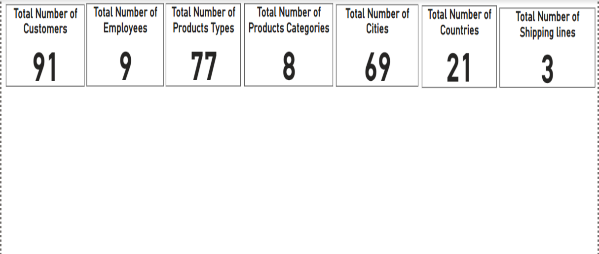
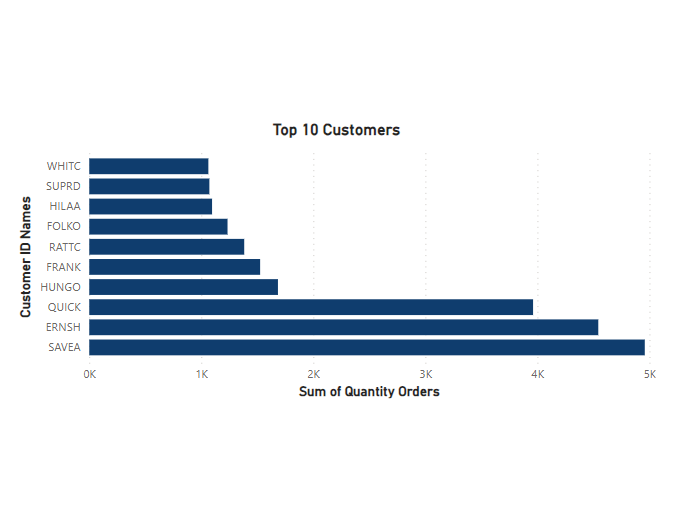
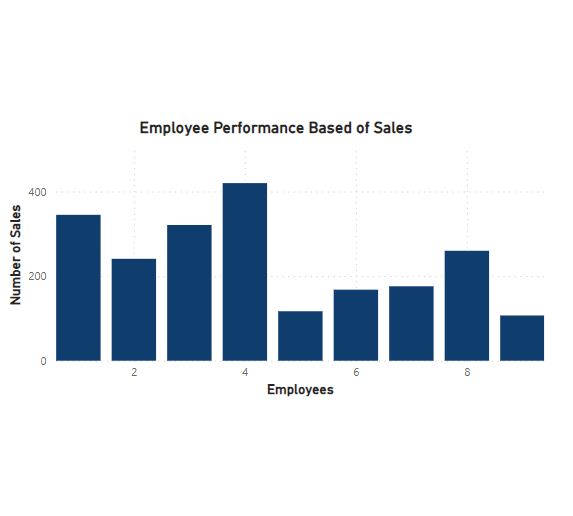
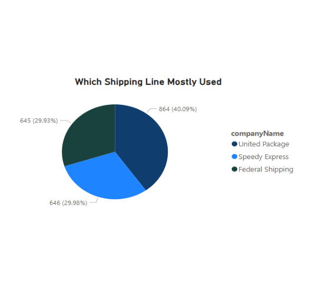
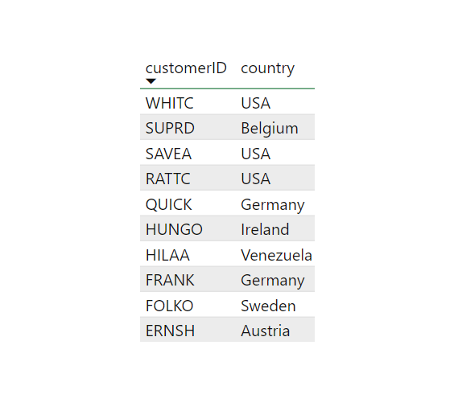
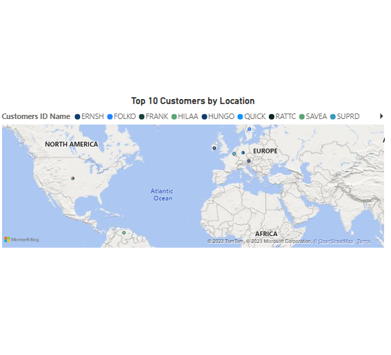

# Traders-dataset-Analysis-Using-Microsoft-Power-BI
## Introduction
This task is to demonstrate analysis of the Northwind traders dataset using Microsoft Power BI for practicing purposes, the analysis requirements are to develop  questions and dashboards
## Problem Statement
1.	What is the total number of customers?
2.	What is the total number of employees?
3.	What is the total number of products?
4.	What is the total number of categories?
5.	What is the total number of cities?
6.	What is the total number of countries?
7.	What is the total number of shipping lines?
8.	Who are the top 10 customers based on the total orders?
9.	What is the sales performance of each employee?
10.	Which shipping line is most preferable?
11.	What is the location of the top 10 customers?
    
## DATA TRANSFORMATION & CLEANING
The data was cleaned and filtered to make it easier to analyze. This included formatting the text and number types to ensure the data would not return errors.
## Analysis & Visualisation
1.	What is the total number of customers? 91
2.	What is the total number of employees? 9
3.	What is the total number of products? 77 
4.	What is the total number of categories? 8 
5.	What is the total number of cities? 69 
6.	What is the total number of countries? 21
7.	What is the total number of shipping lines? 3

## Who are the top 10 customers based on the total orders?
The dashboard shows that the business has a good mix of large and small customers. However, the top customer is a very important customer to the business and accounts for a significant portion of the total quantity of orders.

## What is the sales performance of each employee?
The graph  shows that there is a significant variation in the number of sales per employee. This suggests that some employees are more productive than others. This could be due to a number of factors, such as:
Skill level: Employees with more skills and experience are likely to be more productive.
Motivation: More motivated Employees are likely to be more productive.
Work environment: Employees who work in a positive and supportive work environment are likely to be more productive.

## Which shipping line is most preferable?
 The pie chart shows the distribution of shipping lines used by customers. The chart shows that United Package is the most popular shipping line, accounting for 40.09% of all shipments. Speedy Express and Federal Shipping are the next most popular shipping lines, accounting for 29.93% and 29.96% of all shipments, respectively.
 

 ## What is the location of the top 10 customers?
The table you provided shows the top 10 customers by customer ID, country, and quantity of orders. The customers are from a variety of countries, such as the United States, Germany, and Ireland.
Table                               |          Map
:----------------------------------:|:----------------:
         |     

## Recommendations: 
-The business could focus on marketing and sales efforts to attract more customers from the United States and Germany.
-The business could offer special discounts or loyalty programs to its top customers, such as SAVEA.
- All of the shipping lines could focus on developing new and innovative services to attract and retain customers.
-Some specific actions that companies can take to improve their employee performance and sales results:
•	Invest in employee training and development: Help employees develop the skills and knowledge they need to be successful in their roles.
•	Create a positive and supportive work environment: Provide employees with the resources and support they need to do their jobs well.
•	Set clear and achievable goals: Give employees clear goals to work towards and provide them with regular feedback on their performance.
•	Reward and recognize high performance: Recognize and reward employees for their hard work and achievements.

